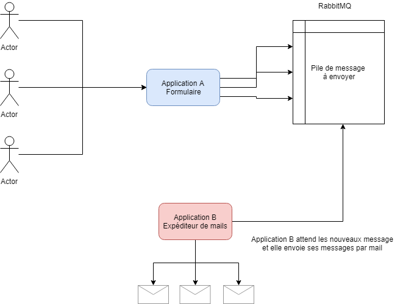
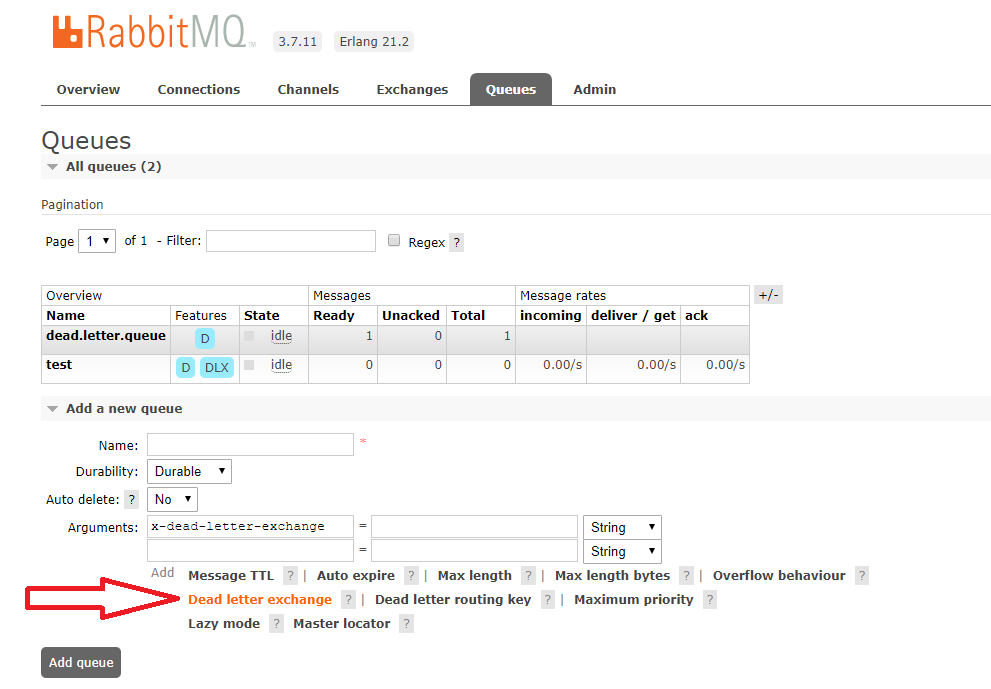

# Fonctionnement

Source : [ici](https://www.rabbitmq.com/tutorials/tutorial-three-php.html)

Type de besoin :

- Deux applications avec communication asynchrone
- Gestion de tâches par queue (pile de tâches)
- Envoie de mails
- Génération de documents par lots
- ...

Exemple avec envoie de mails :

## Création d'une queue pour les messages en erreur (dead)

Lorsque vous utiliser la commande listen, vous pouvez transmettre un accuser de réception (ack ou nack) lorsque vous avez terminé la lecture du message.

Cependant, si pendant la lecture du message il y a une erreur de script, vous pouvez remettre le message dans la queue ou dans une autre queue (dead).

Le but de la dead queue est de ne pas paraliser les consomateurs de la queue de base.

**Insctructions pour créer un dead queue :** 

- Créer un exchange de type FANOUT (dead_exchange)
- Créer une nouvelle queue (dead_queue)
- lier (bind) la dead_queue à dead_exchange
- Créer un nouvelle queue avec dead letter exchange = dead_exchange

Lorsque vous envoyerai un accusé de reception négatif (nack), le message ira dans la dead_queue

## Autres liens

- [Confirmation](https://www.rabbitmq.com/confirms.html)